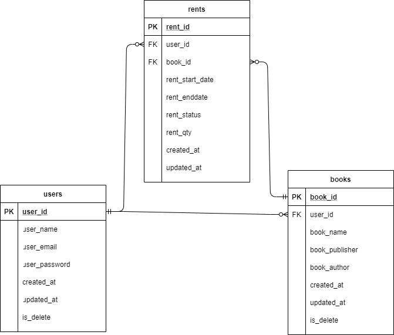

<div align="center">
   <a href="https://github.com/yusnarsetiyadi/Rent-Book-App-Backend">
    
  </a>
</div>

# Rent Book App Backend
    
Rent Book App Backend adalah sebuah aplikasi backend sederhana yang memungkinkan penggunanya dapat membuat akun, login, logout, menambahkan buku, menyewa buku dan lain-lain. Karena ini hanya aplikasi yang dibuat dari backend, maka pengujian aplikasi ini hanya bisa dilakukan dengan platform pengujian API.

# Tech Stack

- [Golang](https://go.dev/)
- [MySQL](https://www.mysql.com/)
- [Redis](https://redis.io/)
- [Gorm](https://gorm.io/index.html)
- [Echo](https://echo.labstack.com/)
- [Postman](https://www.postman.com/)

# ERD

<div align="center">

  
  
</div>

# Desgin Pattern

<div align="center">
   <a>
    
  </a>
</div>

Design Pattern yang digunakan pada aplikasi ini adalah [Clean Architecture](https://blog.cleancoder.com/uncle-bob/2012/08/13/the-clean-architecture.html) yang merupakan konsep arsitektur perangkat lunak dengan tujuan memisahkan dan mengorganisasi code menjadi beberapa lapis bagian untuk mencapai prinsip-prinsip seperti pemisahan perhatian, ketergantungan terbalik, dan pengujian yang lebih mudah. Mengapa saya menggunakan arsitektur seperti ini? Tracking Error menjadi lebih mudah, penambahan atau penghapusan fitur tidak berpengaruh terhadap fitur lain, dan runtime program yang lebih efisien.

# Install Guide

- clone repository ini

```
git clone https://github.com/yusnarsetiyadi/Rent-Book-App-Backend
```
- pindah ke direktori repository ini
```
cd Rent-Book-App-Backend
```
- buat database mysql local anda, kemudian restore dengan file Rent-Book-App-Backend/assets/rentbook_backup_data.sql
- jalankan redis local anda 
```
sudo service redis-server start
```
- jika belum tersedian ikuti tutorial [install redis](https://developer.redis.com/create)
- extract file rar pada folder Rent-Book-App-Backend/assets/ (password: rentbook)
- pindahkan file ".env" ke root folder Rent-Book-App-Backend/
- ganti script export env pada bagian dibawah ini sesuai dengan configurasi mysql local dan redis local anda
```
# db
export DB_USERNAME  =""
export DB_PASSWORD  =""
export DB_HOST      =""
export DB_PORT      =""
export DB_NAME      =""

# redis
export REDIS_ADDRESS    =""
export REDIS_PORT       =""
export REDIS_USER       =
export REDIS_PASSWORD   =""
```
- jalankan file main.go pada root folder
```
go run main.go
```
- testing API dapat dilakukan via Postman, export file /assets/Rentbook.postman_collection.json pada Postman anda (jika menggunakan postman)
- data login user untuk testing sudah saya sediakan pada file /assets/login testing rentbook-app-backend.txt

<div style="text-align:center">

  [About Me](https://github.com/yusnarsetiyadi)

</div>